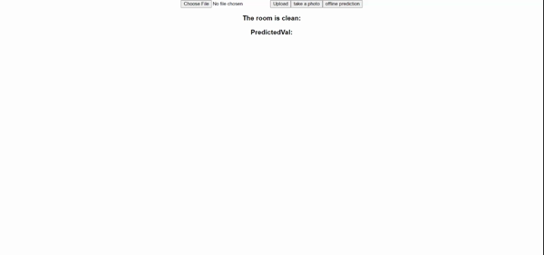

# Clean vs Messy Classifier 
The project attempts to classify a given image as clean or messy. This is an exploratory project wherein we tried to explore various approaches for training and deploying a <i>Machine Learning based binary classification model</i> to be used by an end-user.

## Blog post with more details:
[Clean vs Messy Classifier](https://medium.com/deepklarity/clean-or-messy-classifier-f7d81757be27)

## Usage Instructions:
We used the following approaches to deploy the project:
* [A web app with React frontend and Flask REST API](https://cleanvsmessy.herokuapp.com/)
* [A web app with a tensorflowjs model](https://cleanvsmessy.herokuapp.com/)
* [A web app with python based framework - Streamlit](https://cleanvsmessy-streamlit-app.herokuapp.com/)

## Demo :
<b> React Web app - [Click Here](https://cleanvsmessy.herokuapp.com/) </b>  
 
<b> Streamlit Web app - [Click Here](https://cleanvsmessy-streamlit-app.herokuapp.com/) </b>  

### Data Scraping :
- The data for this project was Scrapped from google Images using <i>Selenium and Python</i>. Check out the Scrapper [readme](scrapper/README.md) for details regarding implementation.
- Also used a publicly available [kaggle dataset](https://www.kaggle.com/cdawn1/messy-vs-clean-room)

### Model Training  :
We trained a binary classification model in <i>Keras and Fastai</i> and then ported Keras model to tfjs, tflite and coreml. The jupyter notebooks are present [here](trainer/).

### Deployment :
The model is deployed using three major approaches : 

- <b>Web App </b>- The web-app based on <i>Flask REST API and frontend using React.</i>
- <b>Web App with offline model</b> - The web app based on the <i>tensorflow js</i> for offline classification.
- <b>Web App </b>- The web app based on Streamlit framework.

The apps were deployed on <b>HEROKU</b>. Heroku deployment instructions are available [here](heroku/README.md).

#### Authored By:
- [Archit Sharma](https://twitter.com/@archiit_sharmaa)
- [Prakhar Pandey](https://twitter.com/Prakhar65361946)

