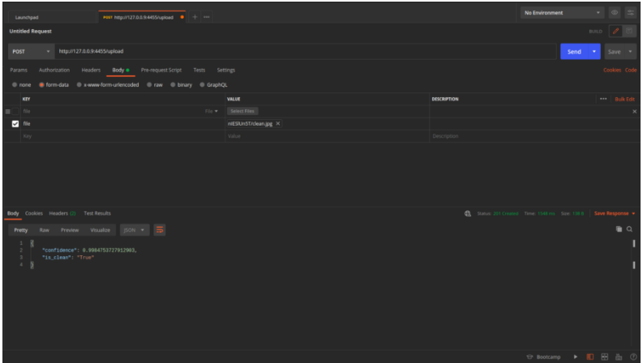

# Server
## A Flask based backend API is used as a Server to handle POST request.
API currently supports deploying a fastai model. Tensorflow or other models could be deployed with some minor modifications.

## Blog post with more details:
blog post here



## Setting up the environment:
Setup a virtual environment using Pycharm or pip. Install the dependencies and requirements using:

```$ pip install -r requirements.txt``` 

## Start the server
To start the server, from current directory run:
```$ python main.py```

## Model:
Fastai exported model is to be placed inside the `model/`

## API:
The API code is in *main.py*.
